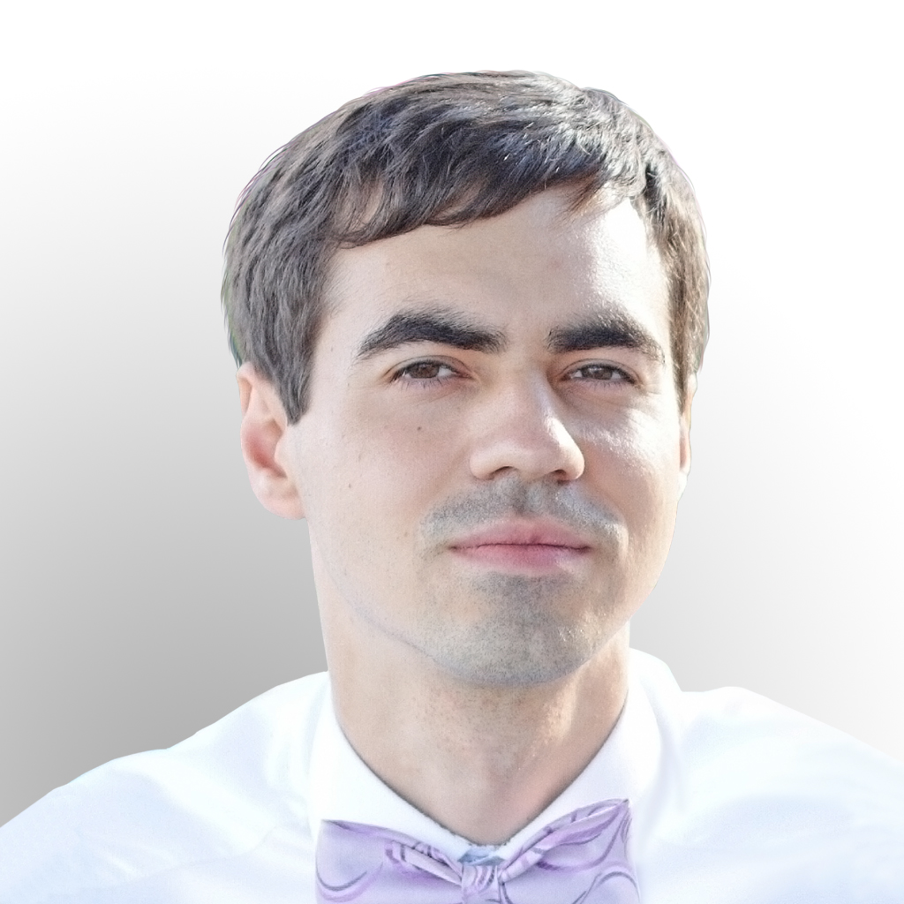

<h1 align="center">Артём Арафаилов</h1>

<h3 align="center">дизайнер</h3>

<table>
  <tbody>
    <tr>
      <td><b>Информация</b></td>
      <td width="50%" rowspan="4">
        
      </td>
    </tr>
    <tr>
      <td>
        <ul>
          <li>artem.ar888@yandex.ru</li>
          <li><a href="https://github.com/artem-ar888">GitHub</a></li>
        </ul>
      </td>
    </tr>
    <tr><td><b>Владение программами</b></td></tr>
    <tr>
      <td width="50%">
        <ul>
          <li>Adobe Photoshop</li>
          <li>Adobe Illustrator</li>
          <li>CorelDRAW</li>
          <li>Microsoft Office</li>
        </ul>
      </td>
    </tr>
  </tbody>
</table>

**О себе**

Рисую логотипы, участвую в конкурсах на fl.ru по их разработке.

Занимаюсь ретушированием фотографий, созданием поздравительных открыток, рисованием графики для компьютерных 2D игр.

Легко обучаюсь, целеустремленный, трудолюбивый, аккуратный, ответственный, работоспособный, креативный, доброжелательный.
